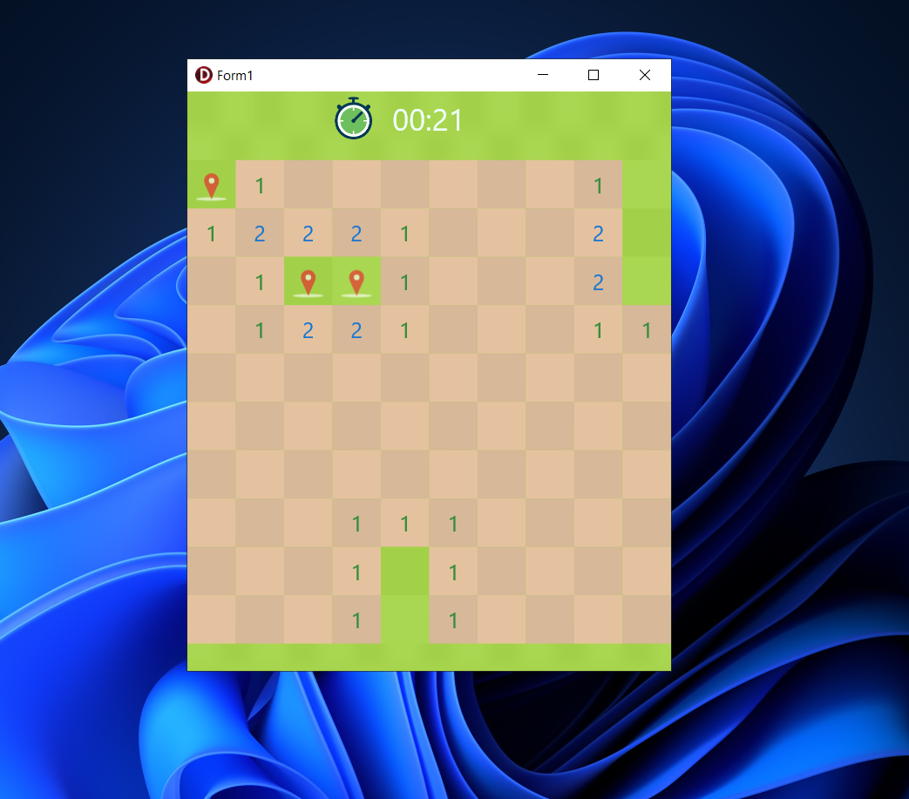
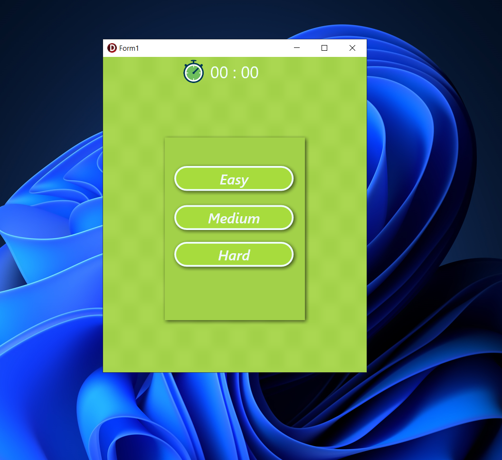
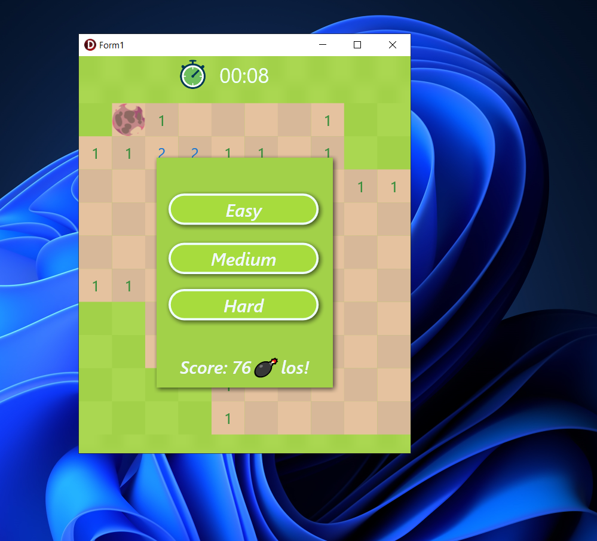

# Minesweeper Game in Delphi FMX

This project is a modern implementation of the classic Minesweeper game, built using Delphi FireMonkey (FMX). It was developed with a strong focus on clean code, responsiveness, and user experience.

✨ Features
🔍 Separation of Concerns:
The game logic is fully separated from the UI. All calculations and game rules are handled in a dedicated module, while the UI layer is responsible only for rendering and user interaction.

🎨 Clean and Organized Code:
The codebase follows clear naming conventions, modular structure, and is easy to understand and extend. This allows for easier maintenance and future enhancements.

🎞️ Smooth Animations:
Visual effects and transitions were added to make the game more enjoyable and dynamic. Tile reveals, explosions, and victory effects are all enhanced with fluid animations.

🔊 Sound Effects:
Audio feedback is included for actions like revealing tiles, hitting a mine, and winning the game, providing a more immersive experience.

🚀 Tools and Technologies
Delphi FMX (FireMonkey) – cross-platform framework for building rich desktop and mobile apps

Object Pascal – the primary programming language

TGlyph and TAnimation – used to enhance the UI and interactivity

Custom Game Engine – logic handled independently from UI for better maintainability

💡 Project Goals
Create a fun and interactive version of Minesweeper

Learn and apply software design principles (like MVC)

Practice animation and audio integration in Delphi

Deliver a polished, user-friendly interface

🙌 Support the Project
If you enjoy the game and would like to support future development, donations are welcome:

Bitcoin (BTC): 1Fz14qx8UNpPQuCUuzyFWdj1hvPr5XSZ8k

USDT / BNB (BEP20): 0x7c5980ef22dca9d392e8aa8b4aeacf44b2dd6bc7

Thank you for your support! 💛

Capture 
 

